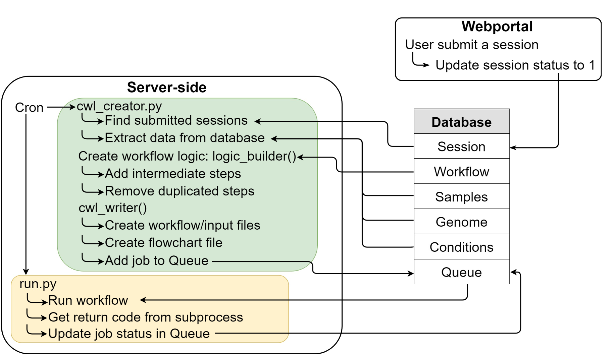

# Flowgen: automatic generating of cwl workflow files

**Note that this repo is currently under heavy reorganisation and refactoring. More detailed documentation is coming soon.**

This repo contains the Python scripts used to generate the cwl workflow file and input file.

The basic steps taken by the scripts to generate workflows are depicted below.

Three major steps are involved in programmatically generating CWL workflows.

1. Extracting user defined workflows from Workflow table
2. Resolve any intermediate steps between tools and remove duplicated steps
3. Add CWL compliant descriptions for each step to the final workflow

SQLAlchemy was used as the object-relational mapper (ORM) to map database tables to Python classes. SQLAlchemy’s syntax isdatabase independent which means virtually no change was needed when switching from a local development database (eg. SQLite) to a remote production database (eg. MySQL). Once `cwl_creator.py` found submitted sessions, the script will extract relevant information from the database and save them into a database_reader object (an instance of database_reader class). A logic_builder object is initiated and the workflow steps are created by passing the database_reader object to the logic_builder. A cwl_writer object is initiated with the database_reader object and by passing the logic_builder object to the cwl_writer object, the write_workflow method of cwl_writer loops through all the unique steps constructed by the logic_builder and write each step as a dictionary entry in the cwl_writer’s cwl_workflow attribute.